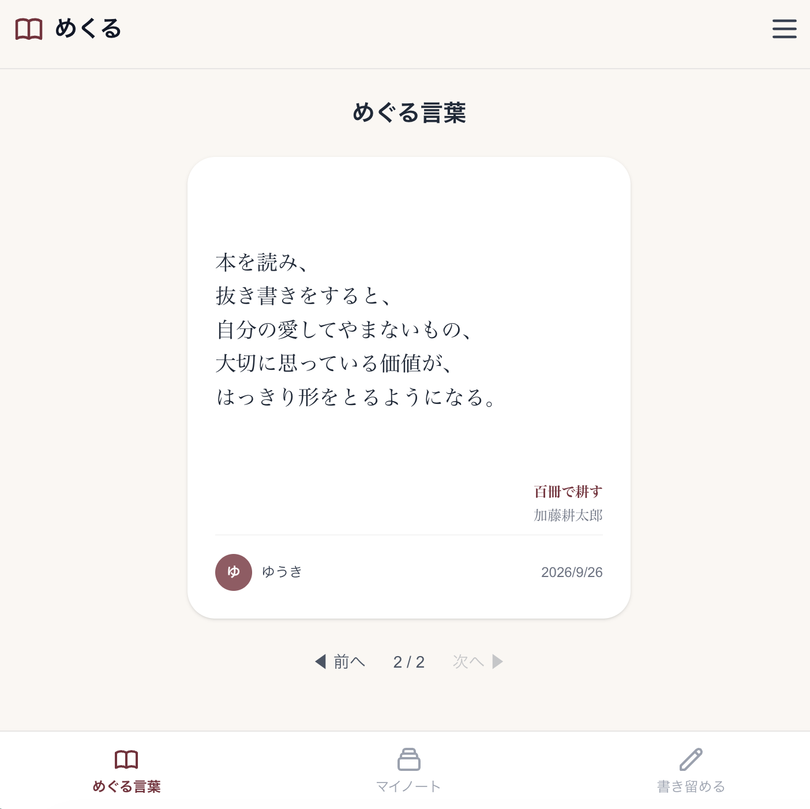
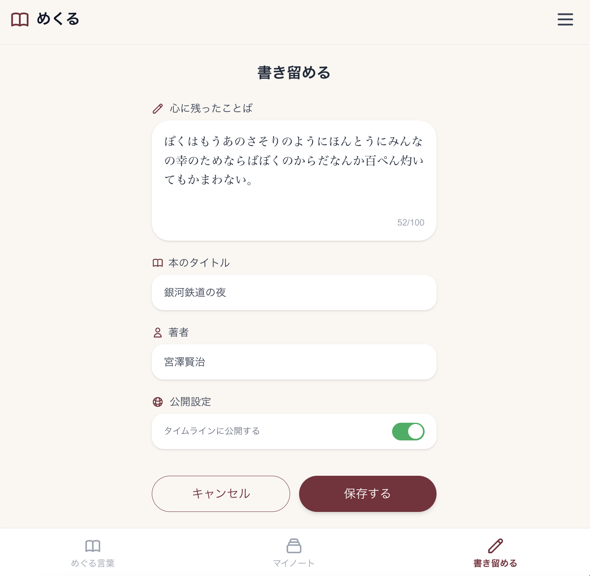
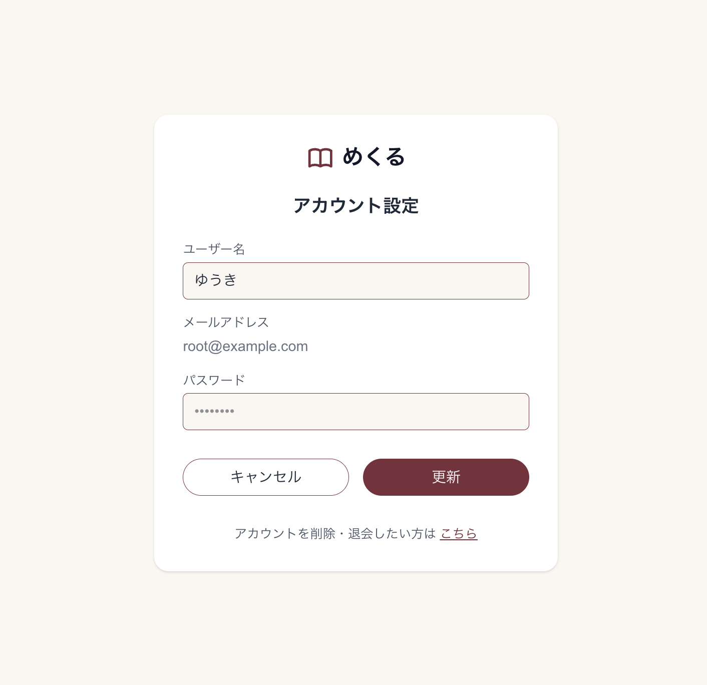

# アプリ名: めくる

このアプリは、心に残った言葉や本を記録・管理・共有するためのWebアプリケーションです。

## デプロイURL

- **本番サイト:** [https://mekuru-app.com](https://mekuru-app.com)
- **新規登録:** アプリ内から新規アカウント登録をしてご利用いただけます。

## 主な機能

- **言葉の記録**: 心に残った言葉や読んだ本の情報をカード形式で登録・編集・削除
- **書籍検索**: Open Library APIを利用した書籍の検索とタイトルの自動取得
- **言葉の閲覧**: 自分自身や他のユーザーの記録を閲覧する
- **タイトルからECサイトへ誘導**: 本のタイトルをクリックするとECサイト(Amazon)に誘導する
- **ユーザー認証**: ログイン・新規登録機能
- **ユーザー情報の更新**: ユーザー名とパスワードの更新、削除

メイン画面(言葉の閲覧)


言葉の記録


ユーザー情報


## 使用技術

| 区分               | 技術・ツール                                                |
| :----------------- | :---------------------------------------------------------- |
| **Infra**          | Amazon Web Service (Route 53, CloudFront, ALB, ECS/Fargate) |
| **Frontend**       | TypeScript, Next.js, Tailwind CSS                           |
| **Backend**        | TypeScript, Next.js Route Handlers                          |
| **Database**       | PostgreSQL, Prisma (ORM)                                    |
| **Authentication** | Auth.js (NextAuth.js)                                       |

## アーキテクチャ構成

Route 53 -> CloudFront -> ALB -> パブリックサブネット (ECS/Next.js) -> プライベートサブネット (RDS/PostgreSQL) の単一AZ構成で構築しています。

## 起動方法

ローカル環境で実行する場合の手順です。

1. **リポジトリをクローンする**
   ```bash
   git clone <リポジトリのURL>
   cd <ディレクトリ名>
   ```
2. **依存パッケージをインストールする**
   ```bash
   npm install
   ```
3. **環境変数（.env）を設定する**

   プロジェクトのルートに .env ファイルを作成し、必要な環境変数（DATABASE_URL や AUTH_SECRET など）を設定します。

4. **開発サーバーを起動する**
   ```bash
   npm run dev
   ```
5. **動作確認をする**

   ブラウザで http://localhost:3000/login を開き、ログイン画面から動作を確認します。
